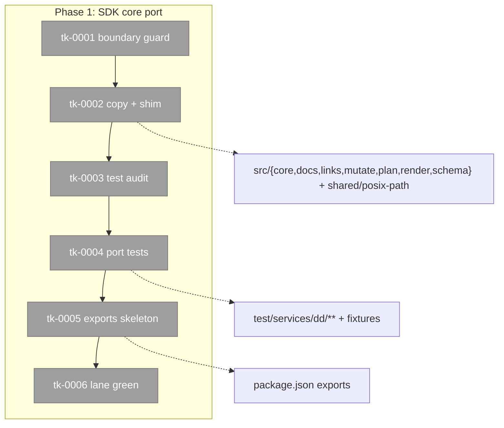

# Context brief — Phase 1: SDK core port
**Plan**: `docs/plans/001-dd-extraction/plan.dd.json` (READY, validated) · **Tasks**: `tasks.dd.json` (tk-0001…tk-0006, canonical — this file is narrative only)

## Executive briefing

**Purpose**: land dd-the-library. `services/dd` is near-self-contained (ONE external
import: `services/shared/posix-path`), so this phase is a disciplined copy + proof, not
a refactor. Everything later (acts, packaging, self-hosting) stands on this tree.

✅ **Goals**: verbatim SDK under `src/`; boundary guard ported; audited test corpus
green; subpath-exports skeleton + consumer-surface test.
❌ **Non-goals**: no CLI acts, no verb registration (`dd status` stays `unconfigured`
all phase); no behavioural edits to SDK code; no exports FREEZE (that is phase 3, after
OQ-1/OQ-2 are ruled).

## Order & dependencies

tk-0001 (read boundary tests) → tk-0002 (copy + shim) → tk-0003 (audit — MUST commit
before any test moves) → tk-0004 (port tests) → tk-0005 (exports skeleton) → tk-0006
(whole lane green). tk-0003 before tk-0004 is load-bearing: a consumer test ported by
accident imports flow internals that do not exist here and reds the suite with a
misleading cause.

## Pre-implementation check

| Surface | State | Note |
|---|---|---|
| `src/` | stub only (app, acts/status+version, output×4, adapters/clock) | SDK subdirs all NEW |
| `test/` | 4 stub tests | mirrored layout already the local convention |
| upstream `services/dd` | 45 files, 7 subdirs | READ-ONLY — copy, never build there |
| upstream tests | 60 files, 4 fixture dirs | audit first (tk-0003) |
| `package.json` | no `exports` subpaths yet | skeleton in tk-0005; `files` already `bin,dist,LICENSE` |

## Key findings that bind this phase (plan `#key_findings`)

- **KF-1 (Critical)**: one external import — any NEW external import introduced by the
  port is a defect, and the tk-0001 guard exists to catch it mechanically.
- **KF-5 (High)**: the upstream architecture tests may already encode the boundary —
  read them FIRST; surface any conflict with this plan to the prime before proceeding.
- **KF-6 (High)**: ~9 upstream tests are consumers, not dd tests — the audit is the
  fence.

## Execution guardrails (plan `#execution_guardrails` — all apply)

harness-engineering READ-ONLY · no publish/tag/release · flow files untouched ·
conventional commits · `dd status` ledger honesty (this phase registers NOTHING).

**Environment-first posture** (builder invariant #14): friction is work — fix small
reversible things; otherwise `harness observe "<what>" --kind difficulty` the moment it
bites; execution-log Discoveries row as fallback.

## Architecture map

## State mutation contract (for the coder)

Task state moves ONLY via CLI:
`harness dd set "docs/plans/001-dd-extraction/assets/tasks/phase-1/tasks.dd.json#tasks/tk-XXXX/state" checked`
and each assertion via `#done_when/tk-XXXX/dw-XXXX/state`. The `.dd.md` sibling is
GENERATED — editing it is drift. Gate rehearsal before leaving the phase:
`harness plan validate docs/plans/001-dd-extraction/plan.dd.json --address "docs/plans/001-dd-extraction/assets/tasks/phase-1/tasks.dd.json#tasks"`.

## Discoveries & learnings

_Populated during implementation (execution.log.md)._
