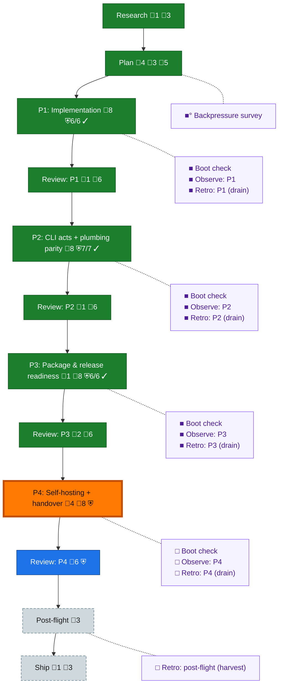

<!-- GENERATED by `harness flow render` — do not hand-edit; regenerate from the flow JSON. -->
# Flow · dd-extraction

**Kind**: flight-plan · **Now**: phase-4 · **Next**: review-4 · **Intent**: set up a new plan, get builder spine in and perform explore step based on our pre-amble. (dd standalone extraction out of harness-engineering) · **Nodes**: 26 · **Events**: 88

**Rail**: ◆─◆─[ ◆─◆─◆─◆─◆─◆─◇─◇─◇ ]─◇  ◆ Research · ◆ Plan · [ ◆ P1: Implementation · ◆ Review: P1 · ◆ P2: CLI acts + plumbing parity · ◆ Review: P2 · ◆ P3: Package & release readiness · ◆ Review: P3 · ◇ P4: Self-hosting + handover · ◇ Review: P4 · ◇ Ship ] · ◇ Post-flight

**Legend** — colour = type/status: 🟩 done · 🟢 in-progress · 🟥 blocked · 🟦 known · ⬜ assumed · 🔶 decision · 🗣 user input · 🟪 harness chore (faded = not yet done) · 🤖 companion · 🛠 worker · 🟧 current (you are here). Badges: 💬 comments · 📄 artifacts · 📝 instructions · 🧰 chore (° optional / recommended / ‼ strongly-recommended; ✓ done · ✕ skipped) · ⛨ dd gate (terminal/total from the last evaluation; ✓ = open). ⛨✓/⛨✕ = a plan-validate check gate (green / not green).

## Node log

### research · Research
- 📄 artifacts: assets/research-dossier.md

### plan · Plan
- 📄 artifacts: plan.dd.json, plan.dd.md, validations/plan.dd-validation.md
- `2026-08-07T03:35:43.104Z` · user · decision — Jordan 2026-08-07: plan hands over to a PM for implementation; phases grouped LOGICALLY (by cohesive subsystem), not by sequencing.
- `2026-08-07T03:40:26.842Z` · user · decision — Jordan 2026-08-07: the plan stage uses the dd-NATIVE builder path — author plan.dd.json (dogfood dd while building it). Late-stage: switch document work to THIS repo's own ported dd CLI (self-hosting), EXCEPT plan checks (harness plan validate stays harness-side).
- `2026-08-07T03:48:35.339Z` · user · decision — Jordan 2026-08-07 (pipeline model): prime authors phase-N tasks -&gt; PM implements with coder -&gt; at PM 'going to review' prime prepares phase N+1 tasks (pipelined) -&gt; review completes -&gt; next phase dispatched -&gt; repeat autonomously to completion. End state: CI green on main, NO PR (working on main). Push-to-main authorized by this ruling (supersedes koala-brief no-push for landing). Questions to Jordan via pij telegram only.
- `2026-08-07T04:14:31.744Z` · agent · validation — Cross-model review (pij-crowded-parakeet, gpt-5.6-sol high): REQUEST_CHANGES, 4 HIGH + 1 MEDIUM — all 5 CONFIRMED and applied: (1) ./plan pulled from public exports pending OQ-2; (2) ac-0002 now enumerates every observed F-04 specifier incl. core/validate + schema/index; (3) ac-0007 pack gate made achievable (registry allowed for declared deps, repo-absence is the proof); (4) tk-0001 now ports BOTH architecture guards incl. frozen-semantics digest re-pin; (5) ac-0004/ac-0005 coverage cross-wire swapped. plan validate 0/0 post-fix. time:2026-08-07T04:14:31Z

### ship · Ship
- `2026-08-07T03:40:26.998Z` · user · decision — Jordan 2026-08-07: definition of handover = SDK passable to pij-related-koala. Koala integrates into harness and strips the old in-tree code — explicitly NOT this repo's task.

### backpressure · Backpressure survey
- `2026-08-07T03:55:15.317Z` · agent · validation — decision:redirect (real /eng-harness-flow --hook pre-coding envelope) reason:S2-governance-missing — .harness/engineering-harness.md absent, survey UNAVAILABLE; harness init offered to Jordan, unanswered. basis_sha256:e40c64f4ab776c8c362f2346205a0440545adb4c35d6106e1ad6b89478903caa time:2026-08-07T03:55:15Z

### boot-1 · Boot check
- `2026-08-07T04:50:54.798Z` · agent · validation — decision:redirect (real /eng-harness-flow --hook pre-flight invocation) reason:S2-governance-missing, boot UNAVAILABLE behind adoption gate; harness init offered to Jordan, standing. Phase-1 boot evidence exists out-of-band (just checks exit 0, 352 tests). time:2026-08-07T04:50:54Z

### observe-1 · Observe: P1
- `2026-08-07T04:50:55.104Z` · agent · validation — captures:1 pointer:harness observe kind:insight (agent bucket, phase-1 discoveries: 48-vs-45 file count, KF-1 stronger than stated, dependency-cruiser replacement, reviewer half-proof caught by PM) time:2026-08-07T04:50:54Z

### retro-1 · Retro: P1 (drain)
- `2026-08-07T04:51:21.289Z` · agent · validation — decision:redirect (real /eng-harness-flow --hook post-coding invocation) reason:S2-governance-missing, retro UNAVAILABLE; observe buffer intact (5 captures, durable) — drains when harness init lands. time:2026-08-07T04:51:21Z

### review-2 · Review: P2
- `2026-08-07T05:46:30.440Z` · agent · validation — Verdict APPROVE, ZERO findings (pij-blind-deer, dlg-0002) — survived the PM red-flag test (3 mutations w/ distinct RED signatures, 7-commit ledger matched independent rebuild). ac-0003/0004/0005/0006 flipped checked, proven_by lg-0003. 43-string rename pre-ruled into P3 so not scored. time:2026-08-07T05:46:29Z

### boot-2 · Boot check
- `2026-08-07T05:46:11.541Z` · agent · validation — decision:redirect (real /eng-harness-flow --hook pre-flight invocation #4) reason:S2-governance-missing. Phase-2 out-of-band boot evidence: just checks exit 0, 642 tests. time:2026-08-07T05:46:11Z

### observe-2 · Observe: P2
- `2026-08-07T05:46:11.940Z` · agent · validation — captures:1 pointer:harness observe kind:insight (agent bucket — top-level registration, PROVING_COMMANDS fix, background-* drop, cross-slice module/verb split) time:2026-08-07T05:46:11Z

### retro-2 · Retro: P2 (drain)
- `2026-08-07T05:46:29.753Z` · agent · validation — decision:redirect (real /eng-harness-flow --hook post-coding invocation #5) reason:S2-governance-missing; buffer 6 captures, durable. time:2026-08-07T05:46:29Z

### phase-3 · P3: Package & release readiness
- `2026-08-07T05:52:11.311Z` · agent · decision — Rename-collision rulings (dlg-0003): (1) YES local-bin switch for document mutation at tk-0003 landing — prime declares a FLIP-FREEZE from now until it lands (no harness dd set from the prime; no flips are pending, next is at P3 verdict which follows tk-0003), so the coder regenerates ALL siblings incl. plan.dd.md + execution-log.dd.md with no concurrent writer and dw-0003 stays satisfiable as written; (2) authority SPLIT — harness plan validate keeps semantics, local dd build --check owns drift, banner-only-diff test adjudicates; (3) PARTIAL phase-4 pull-forward by consequence: the mutation-surface switch lands with tk-0003, phase-4 keeps full self-host proof + backlog migration + handover. Guardrail added to plan.

### review-3 · Review: P3
- `2026-08-07T06:23:39.031Z` · agent · validation — Verdict FIX_REQUIRED (pij-blind-deer, rev-0003): 1 HIGH blocking — README anti-rot guard VACUOUS (extracts JSON heredocs only, dd commands hardcoded; reviewer proved it green on a nonexistent verb). 3 MEDIUM: same-commit sibling claim corrected (achieved invariant = zero stale banners, history not rewritten), WARN-count rot (fix = measured-at stamping, now a plan guardrail), esc-4 amendment folded. HELD FREEZE UPHELD — reviewer independently confirmed no exports expectation leaked anywhere. Fix loop with the coder; P4 held; ac-0007 flip HELD until clean re-review. time:2026-08-07T06:23:38Z
- `2026-08-07T06:45:09.844Z` · agent · validation — decision:done verdict:APPROVE reason:dlg-0003-fix re-review clean, all four findings closed. Report /Users/jordanknight/.pij/pij-blind-deer/reports/dlg-0003-fix-rereview.md; persisted rev-0003-fix.json supersedes rev-0003. Measured at 6859619. HIGH (vacuous README guard) fixed 8a13e53 and proven mutation-RESISTANT: M1 nonexistent verb reds by command exit code, M2 real verb + absent address dw-9999 reds at E450 target-unknown, M3 unparseable line reds at collection. Restore byte-identical, 12/12 green. Two MEDIUM receipt-accuracy defects fixed 91b2103 + 0a2f1c3. Exports freeze independently re-verified held at HEAD by PM and reviewer (tk-0001/tk-0002 unchecked, ./plan absent, package-manifest.test.ts asserts nothing about exports). ac-0007 flipped, proven_by execution-log lg-0004. time:2026-08-07T06:45:00Z

### boot-3 · Boot check
- `2026-08-07T06:44:59.835Z` · agent · validation — decision:done verdict:UNAVAILABLE reason:real /eng-harness-flow --hook pre-flight invocation, boot module Step 0b. Governance doc .harness/engineering-harness.md ABSENT, so mode resolves UNAVAILABLE — boot degrades gracefully, does not block. Underlying substrate is HEALTHY and was exercised: harness boot ran 'just boot' status ok, tsc build clean, 7/7 tests passed in 617ms; checks extension present at .harness/extensions/checks so the quality gate exists. Signals: checks-gate present; governance/maturity/back-pressure NOT DECLARED (no doc to declare them). Housekeeping surfaced: 125 telemetry segments unpushed across 4 sessions. Provisioning the doc is the 'harness init' CLI writer's job, not this module, and remains a standing unactioned offer to Jordan. time:2026-08-07T06:44:43Z

### observe-3 · Observe: P3
- `2026-08-07T06:44:23.187Z` · agent · validation — decision:done verdict:captured reason:real captures made during phase 3, not narrated — DL-009 (out-of-diff review escapes), DL-010 (renderer guardrail violated by its own author), DL-011 (git add -A staging .dlg-* worktrees as gitlinks). Record pointer: .harness/records/retro/2026-08-07/001-001-dd-extraction-phase-3.md. time:2026-08-07T06:44:12Z

### retro-3 · Retro: P3 (drain)
- `2026-08-07T06:44:23.025Z` · agent · validation — decision:done verdict:drained reason:real /eng-harness-flow --hook post-coding invocation; harness observe --list returned 13 pending (buffer had never drained — accumulated across phases 1-3). harness record retro --slug 001-dd-extraction-phase-3 placed .harness/records/retro/2026-08-07/001-001-dd-extraction-phase-3.md; all 13 written with dispositions (12 kept/open, DL-011 fixed-now/encoded resolved_by e1c47d8); harness observe --clear reported cleared:13, malformed_skipped:0; re-list confirms empty. time:2026-08-07T06:44:12Z

### phase-4 · P4: Self-hosting + handover
- `2026-08-07T06:49:59.625Z` · agent · decision — o-prime rulings on the PM's two phase-4 gates, 2026-08-07. GATE 1 CONFIRMED: tk-0006 (first push of main) is held on review AND the PM's go, not merely on tk-0001. Jordan's 2026-08-07 authorization settles WHETHER we push, not the sequence; 34+ unreviewed commits landing on a shared main is the one act in this plan that is not cheaply reversible, so review precedes it. GATE 2 OVERRULED IN PART: tk-0005 prepares the handover packet and the PM does NOT send it — correct — but the send is taken by the o-prime, not the PM: pij-related-koala is a peer prime, so handover is prime-to-prime traffic. PM signals packet-ready post-review; o-prime sends. HONESTY ITEM ENDORSED: the packet must state plainly that the exports map is NOT frozen (tk-0002 held on Jordan OQ-1/OQ-2) rather than list 'frozen exports map' as a delivered artifact. This is the first time the claim-outran-implementation class (guardrail 11) has been caught BEFORE shipping rather than in review — and koala is precisely the reader a false completeness claim would mislead.
- `2026-08-07T06:59:35.087Z` · agent · validation — CORRECTION to my own gate-1 record (o-prime, append-only, 2026-08-07). The commit message at 20e412c and my phase-4 decision comment both described tk-0006 as the FIRST push of main and cited '34+ commits'. Both were wrong and the error was mine to carry: I repeated the PM's stale framing without measuring it. Measured independently at 20e412c: origin exists (https://github.com/AI-Substrate/dd.git), origin/main = b1b794db2133fb50eeee85f63a6bfb2a1a0ad2ea,  succeeds, 0	46 = 0 behind / 46 ahead. It is a FAST-FORWARD of 46 commits onto an existing shared main — no rewrite, no force, not a virgin push. GATE 1 IS UNAFFECTED and stands on its real reason, which the correction does not touch: unreviewed work landing on a shared main is not cheaply reversible. Re-derive with the two git commands above. This is the measured-at-stamping guardrail applied to the o-prime's own artifact — the third time this class has been caught, and the first time in my own record.
- `2026-08-07T06:59:35.798Z` · agent · decision — RULING on ESC-1 (red Release run beside green CI). GATE THE WORKFLOW — do not accept the red, and this does NOT need Jordan. It is not a new decision: koala's standing brief already rules it, verbatim — 'Release enablement (RELEASE_PLEASE_TOKEN + npm trusted publisher) is Jordan's; the workflows sit inert until then.' A workflow that fires on push to main and goes red is not inert. The coder's own note draws the distinction correctly ('fails closed is not the same as inert'), so the implementation simply does not yet meet a constraint that predates this phase. MECHANISM (minimal + reversible): drop  from release.yml's push trigger, keeping  and workflow_dispatch, so the release path stays fully exercisable pre-merge and one line restores it when Jordan adds the token. Document the exact restore line in the workflow with a measured-at stamp. The PM's attention-cost argument is right and is the deciding one: a red everyone learns to ignore is worse than no signal, because the day it reds for a real reason nobody looks — and koala inherits this repo. tk-0006 done = the CI workflow green, unchanged. Verified for this ruling at 20e412c: 0 workflows registered on origin,  empty, repo PUBLIC.
- `2026-08-07T07:00:04.302Z` · agent · validation — TRANSCRIPTION REPAIR of the ESC-1 ruling comment immediately above (o-prime, append-only — comments are never edited). Backticks in that text were shell-evaluated on the way in, so two branch names were silently eaten and the MECHANISM sentence reads 'drop  from ... keeping  and workflow_dispatch'. The intended, ruling text is: drop the branch named main from release.yml's push trigger, KEEPING the canary branch pattern (canary/ followed by a double-star glob) and workflow_dispatch. Everything else in that comment stands as written. Restore, when Jordan supplies RELEASE_PLEASE_TOKEN, is re-adding main to that same push branches list — one line. Friction captured: composing a CLI comment through a shell is a transcription hazard for exactly the artifact class that must be verbatim.

### review-1 · Review: P1
- `2026-08-07T04:51:22.465Z` · agent · validation — Verdict APPROVE_WITH_NOTES (pij-blind-deer, gpt-5.6-terra:high) — no blocking findings; single MEDIUM (docs-drift) lands owned in phase-2 tk-0006. PM closed a reviewer gap by mutation: frozen-semantics guard proven RED at :61 (newline inject) after the reviewer had proven only the isolation guard while reporting both green. ac-0001 flipped checked, proven_by execution-log.dd.json#entries/lg-0001. time:2026-08-07T04:51:21Z
