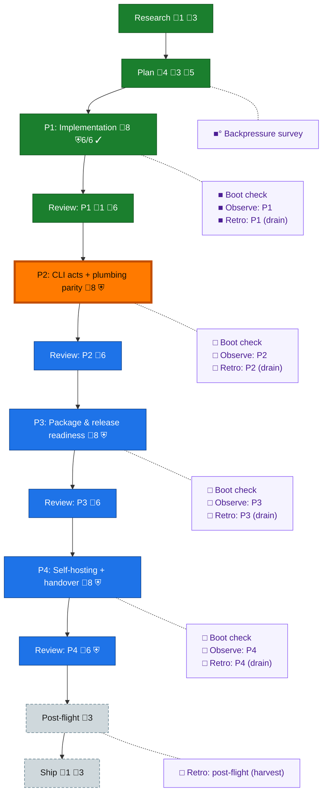

<!-- GENERATED by `harness flow render` — do not hand-edit; regenerate from the flow JSON. -->
# Flow · dd-extraction

**Kind**: flight-plan · **Now**: phase-2 · **Next**: review-2 · **Intent**: set up a new plan, get builder spine in and perform explore step based on our pre-amble. (dd standalone extraction out of harness-engineering) · **Nodes**: 26 · **Events**: 60

**Rail**: ◆─◆─[ ◆─◆─◐─◇─◇─◇─◇─◇─◇ ]─◇  ◆ Research · ◆ Plan · [ ◆ P1: Implementation · ◆ Review: P1 · ◐ P2: CLI acts + plumbing parity · ◇ Review: P2 · ◇ P3: Package & release readiness · ◇ Review: P3 · ◇ P4: Self-hosting + handover · ◇ Review: P4 · ◇ Ship ] · ◇ Post-flight

**Legend** — colour = type/status: 🟩 done · 🟢 in-progress · 🟥 blocked · 🟦 known · ⬜ assumed · 🔶 decision · 🗣 user input · 🟪 harness chore (faded = not yet done) · 🤖 companion · 🛠 worker · 🟧 current (you are here). Badges: 💬 comments · 📄 artifacts · 📝 instructions · 🧰 chore (° optional / recommended / ‼ strongly-recommended; ✓ done · ✕ skipped) · ⛨ dd gate (terminal/total from the last evaluation; ✓ = open). ⛨✓/⛨✕ = a plan-validate check gate (green / not green).

## Node log

### research · Research
- 📄 artifacts: assets/research-dossier.md

### plan · Plan
- 📄 artifacts: plan.dd.json, plan.dd.md, validations/plan.dd-validation.md
- `2026-08-07T03:35:43.104Z` · user · decision — Jordan 2026-08-07: plan hands over to a PM for implementation; phases grouped LOGICALLY (by cohesive subsystem), not by sequencing.
- `2026-08-07T03:40:26.842Z` · user · decision — Jordan 2026-08-07: the plan stage uses the dd-NATIVE builder path — author plan.dd.json (dogfood dd while building it). Late-stage: switch document work to THIS repo's own ported dd CLI (self-hosting), EXCEPT plan checks (harness plan validate stays harness-side).
- `2026-08-07T03:48:35.339Z` · user · decision — Jordan 2026-08-07 (pipeline model): prime authors phase-N tasks -&gt; PM implements with coder -&gt; at PM 'going to review' prime prepares phase N+1 tasks (pipelined) -&gt; review completes -&gt; next phase dispatched -&gt; repeat autonomously to completion. End state: CI green on main, NO PR (working on main). Push-to-main authorized by this ruling (supersedes koala-brief no-push for landing). Questions to Jordan via pij telegram only.
- `2026-08-07T04:14:31.744Z` · agent · validation — Cross-model review (pij-crowded-parakeet, gpt-5.6-sol high): REQUEST_CHANGES, 4 HIGH + 1 MEDIUM — all 5 CONFIRMED and applied: (1) ./plan pulled from public exports pending OQ-2; (2) ac-0002 now enumerates every observed F-04 specifier incl. core/validate + schema/index; (3) ac-0007 pack gate made achievable (registry allowed for declared deps, repo-absence is the proof); (4) tk-0001 now ports BOTH architecture guards incl. frozen-semantics digest re-pin; (5) ac-0004/ac-0005 coverage cross-wire swapped. plan validate 0/0 post-fix. time:2026-08-07T04:14:31Z

### ship · Ship
- `2026-08-07T03:40:26.998Z` · user · decision — Jordan 2026-08-07: definition of handover = SDK passable to pij-related-koala. Koala integrates into harness and strips the old in-tree code — explicitly NOT this repo's task.

### backpressure · Backpressure survey
- `2026-08-07T03:55:15.317Z` · agent · validation — decision:redirect (real /eng-harness-flow --hook pre-coding envelope) reason:S2-governance-missing — .harness/engineering-harness.md absent, survey UNAVAILABLE; harness init offered to Jordan, unanswered. basis_sha256:e40c64f4ab776c8c362f2346205a0440545adb4c35d6106e1ad6b89478903caa time:2026-08-07T03:55:15Z

### boot-1 · Boot check
- `2026-08-07T04:50:54.798Z` · agent · validation — decision:redirect (real /eng-harness-flow --hook pre-flight invocation) reason:S2-governance-missing, boot UNAVAILABLE behind adoption gate; harness init offered to Jordan, standing. Phase-1 boot evidence exists out-of-band (just checks exit 0, 352 tests). time:2026-08-07T04:50:54Z

### observe-1 · Observe: P1
- `2026-08-07T04:50:55.104Z` · agent · validation — captures:1 pointer:harness observe kind:insight (agent bucket, phase-1 discoveries: 48-vs-45 file count, KF-1 stronger than stated, dependency-cruiser replacement, reviewer half-proof caught by PM) time:2026-08-07T04:50:54Z

### retro-1 · Retro: P1 (drain)
- `2026-08-07T04:51:21.289Z` · agent · validation — decision:redirect (real /eng-harness-flow --hook post-coding invocation) reason:S2-governance-missing, retro UNAVAILABLE; observe buffer intact (5 captures, durable) — drains when harness init lands. time:2026-08-07T04:51:21Z

### review-1 · Review: P1
- `2026-08-07T04:51:22.465Z` · agent · validation — Verdict APPROVE_WITH_NOTES (pij-blind-deer, gpt-5.6-terra:high) — no blocking findings; single MEDIUM (docs-drift) lands owned in phase-2 tk-0006. PM closed a reviewer gap by mutation: frozen-semantics guard proven RED at :61 (newline inject) after the reviewer had proven only the isolation guard while reporting both green. ac-0001 flipped checked, proven_by execution-log.dd.json#entries/lg-0001. time:2026-08-07T04:51:21Z
