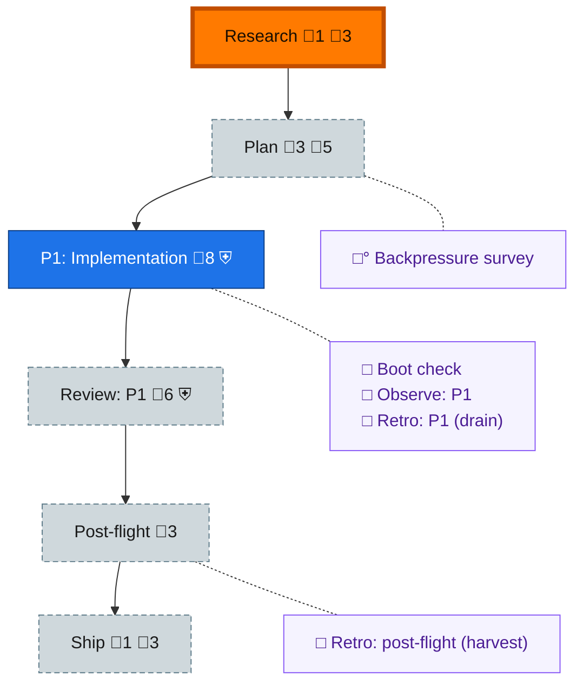

<!-- GENERATED by `harness flow render` — do not hand-edit; regenerate from the flow JSON. -->
# Flow · dd-extraction

**Kind**: flight-plan · **Now**: research · **Next**: plan · **Intent**: set up a new plan, get builder spine in and perform explore step based on our pre-amble. (dd standalone extraction out of harness-engineering) · **Nodes**: 11 · **Events**: 9

**Rail**: ◆─◇─[ ◇─◇─◇ ]─◇  ◆ Research · ◇ Plan · [ ◇ P1: Implementation · ◇ Review: P1 · ◇ Ship ] · ◇ Post-flight

**Legend** — colour = type/status: 🟩 done · 🟢 in-progress · 🟥 blocked · 🟦 known · ⬜ assumed · 🔶 decision · 🗣 user input · 🟪 harness chore (faded = not yet done) · 🤖 companion · 🛠 worker · 🟧 current (you are here). Badges: 💬 comments · 📄 artifacts · 📝 instructions · 🧰 chore (° optional / recommended / ‼ strongly-recommended; ✓ done · ✕ skipped) · ⛨ dd gate (terminal/total from the last evaluation; ✓ = open). ⛨✓/⛨✕ = a plan-validate check gate (green / not green).

## Node log

### research · Research
- 📄 artifacts: assets/research-dossier.md

### plan · Plan
- `2026-08-07T03:35:43.104Z` · user · decision — Jordan 2026-08-07: plan hands over to a PM for implementation; phases grouped LOGICALLY (by cohesive subsystem), not by sequencing.
- `2026-08-07T03:40:26.842Z` · user · decision — Jordan 2026-08-07: the plan stage uses the dd-NATIVE builder path — author plan.dd.json (dogfood dd while building it). Late-stage: switch document work to THIS repo's own ported dd CLI (self-hosting), EXCEPT plan checks (harness plan validate stays harness-side).
- `2026-08-07T03:48:35.339Z` · user · decision — Jordan 2026-08-07 (pipeline model): prime authors phase-N tasks -&gt; PM implements with coder -&gt; at PM 'going to review' prime prepares phase N+1 tasks (pipelined) -&gt; review completes -&gt; next phase dispatched -&gt; repeat autonomously to completion. End state: CI green on main, NO PR (working on main). Push-to-main authorized by this ruling (supersedes koala-brief no-push for landing). Questions to Jordan via pij telegram only.

### ship · Ship
- `2026-08-07T03:40:26.998Z` · user · decision — Jordan 2026-08-07: definition of handover = SDK passable to pij-related-koala. Koala integrates into harness and strips the old in-tree code — explicitly NOT this repo's task.
