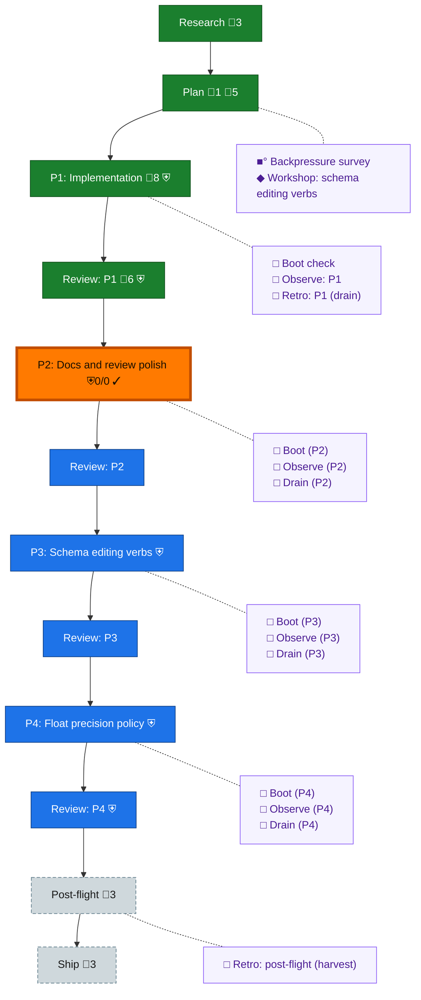

<!-- GENERATED by `harness flow render` — do not hand-edit; regenerate from the flow JSON. -->
# Flow · tally-columns

**Kind**: flight-plan · **Now**: phase-2 · **Next**: review-2 · **Intent**: Retroactive: tally columns — sums over a dd table with nothing implicit; substrate built and committed, docs and schema verbs open · **Nodes**: 27 · **Events**: 34

**Rail**: ◆─◆─[ ◆─◆─◇─◇─◇─◇─◇─◇─◇ ]─◇  ◆ Research · ◆ Plan · [ ◆ P1: Implementation · ◆ Review: P1 · ◇ P2: Docs and review polish · ◇ Review: P2 · ◇ P3: Schema editing verbs · ◇ Review: P3 · ◇ P4: Float precision policy · ◇ Review: P4 · ◇ Ship ] · ◇ Post-flight

**Legend** — colour = type/status: 🟩 done · 🟢 in-progress · 🟥 blocked · 🟦 known · ⬜ assumed · 🔶 decision · 🗣 user input · 🟪 harness chore (faded = not yet done) · 🤖 companion · 🛠 worker · 🟧 current (you are here). Badges: 💬 comments · 📄 artifacts · 📝 instructions · 🧰 chore (° optional / recommended / ‼ strongly-recommended; ✓ done · ✕ skipped) · ⛨ dd gate (terminal/total from the last evaluation; ✓ = open). ⛨✓/⛨✕ = a plan-validate check gate (green / not green).

## Node log

### plan · Plan
- `2026-08-12T03:10:43.130Z` · agent · note — Dogfood: 5 frictions recorded (fr-0013..fr-0017). fr-0017 is blocking-class — the harness-bundled dd and this repo's bin disagree, so the paved writers leave the self-host gate red.

### backpressure · Backpressure survey
- `2026-08-12T03:05:30.510Z` · agent · validation — decision:route verdict:Partial reason:survey run against plan.dd.json; 3 RUN / 6 EXTEND / 0 BUILD / 1 ABSENT; every gap is an extension to an existing sensor, no new sensor needed. artifact:assets/backpressure-coverage.md time:2026-08-12T03:10:00Z basis_sha256:3ac565598047ecaad76db37ad324b36d194adf37185d3a5ddc5589652d4732a7
